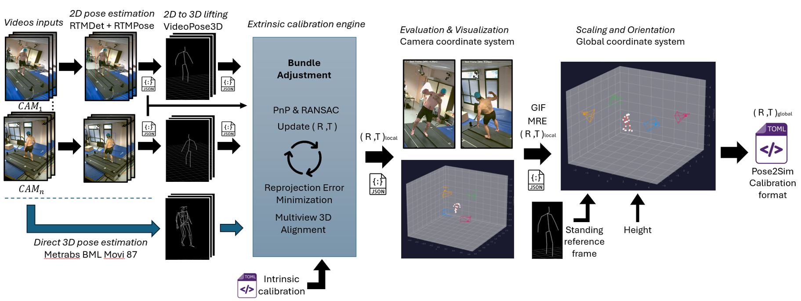

# Dynamic Extrinsic Camera Calibrator

A complete pipeline for **extrinsic camera calibration from a moving person**. It leverages human pose estimation to calibrate multi-camera setups without needing a checkerboard or specialized calibration patterns — just a person walking in the scene.

Two pose estimation architectures are supported, with fundamentally different approaches:

- **MeTRAbs (recommended)** — Predicts **metric 3D poses directly** from each camera view in a single step. With 87 body joints from the `bml_movi_87` skeleton, it provides a rich, dense representation that yields high-quality calibrations. The per-camera 3D predictions enable **Procrustes alignment** as initialization, giving a strong starting point before bundle adjustment.
- **RTMPose + VideoPose3D** — The classic two-step approach: first detect **2D keypoints** with RTMPose, then **lift to 3D** with VideoPose3D. This uses 25 OpenPose joints (12 bones) and produces relative-scale 3D, requiring more optimization effort to converge.

In short, MeTRAbs collapses the 2D detection + 3D lifting into a **single forward pass** that outputs metric-scale 3D, while the RTMPose path requires two separate models and produces relative-scale 3D that must be rescaled during calibration.



---

## Pipeline Overview

The pipeline processes synchronized multi-camera videos through a 7-step pipeline orchestrated by `calibrate.sh`:

| Step | Script | Description |
|------|--------|-------------|
| **1. Pose Extraction** | `metrabs_inference.py` or `rtmlib_inference.py` | Detect 2D keypoints (+ direct metric 3D with MeTRAbs) in all camera views |
| **2. Intrinsics Loading** | `create_cameras_from_toml.py` | Parse camera matrices & distortion from a Pose2Sim-compatible TOML |
| **3. Configuration** | *(inline in calibrate.sh)* | Auto-detect number of cameras, joints, frame count; write `config.yaml` |
| **4. 3D Lifting** | `pose/inference.py` | Lift 2D→3D with VideoPose3D *(skipped when using MeTRAbs — 3D is already available)* |
| **5. Calibration** | `scripts/run_calib_linear.py` → `calibration/calib_linear.py` → `scripts/run_ba.py` → `calibration/ba.py` | Chunked linear calibration (with Procrustes init for MeTRAbs) + Bundle Adjustment |
| **6. Evaluation** | `evaluate_calibration.py` | Compute Mean Reprojection Error (MRE) per camera + visualizations |
| **7. Scaling** | `scale_scene.py` | Orient scene (gravity-aligned) and scale to metric units using person height |

**Final output:** `Calib_scene_calibrated.toml` with extrinsic parameters (R, t) for each camera in a real-world metric coordinate system.

---

## Pose Engines

Two pose estimation backends are supported, with fundamentally different architectures:

### MeTRAbs (recommended) — Direct 3D in one step

[MeTRAbs](https://github.com/isarandi/metrabs) is a metric-scale 3D human pose estimator that predicts **2D and 3D poses simultaneously** in a single forward pass. Unlike the traditional two-step pipeline (2D detection → 3D lifting), MeTRAbs directly outputs **metric 3D coordinates** (in millimeters) from each camera view independently.

**Why this matters for calibration:** since each camera produces its own 3D skeleton in metric scale, we can use **Procrustes alignment** to find the relative rotation and translation between cameras directly from their 3D predictions — without needing an intermediate triangulation step. This gives a much better initialization for bundle adjustment compared to 2D-only methods.

We use the **`bml_movi_87`** skeleton (87 joints from the [BML MoVi](https://www.biomotionlab.ca/movi/) dataset). The full 87-joint 2D and 3D predictions are stored for each camera, and a **26-joint calibration subset** is extracted for the calibration pipeline:

- **20 virtual joint centers** (head, thorax, pelvis, hips, shoulders, elbows, wrists, hands, knees, ankles, feet)
- **2 anatomical landmarks** (backneck, sternum)
- **4 foot markers** (left/right heel, left/right toe)

These 26 joints are connected by **27 bones** covering the full body including a 4-segment spine and articulated feet — significantly richer than OpenPose's 12 bones. The mapping from `bml_movi_87` to our 26-joint format is defined in `util.py` (`METRABS_BML87_INDICES`). Additionally, a **Halpe26 conversion** is generated for backward compatibility with the scaling step.

**Temporal smoothing:** a Savitzky-Golay filter is applied to both 2D and 3D trajectories to reduce frame-to-frame jitter on valid detections.

| Property | Value |
|----------|-------|
| Model | `metrabs_l` (EffNetV2-L backbone) via TensorFlow Hub |
| Input skeleton | `bml_movi_87` (87 joints) |
| Stored output | Full 87-joint 2D + 3D, 26-joint calib subset, Halpe26 2D |
| 3D output | Metric (millimeters), per-camera coordinate frame |
| Architecture | Single-step: image → 2D + 3D simultaneously |
| Conda env | `metrabs_opensim` (Python 3.10, TensorFlow 2.x) |
| Speed | ~2 min/camera on GPU |

### RTMPose + VideoPose3D — Two-step 2D→3D lifting

The classic two-step path uses [RTMPose](https://github.com/Tau-J/rtmlib) (via `rtmlib`) for **2D keypoint detection** in **Halpe26** format, then [VideoPose3D](https://github.com/facebookresearch/VideoPose3D) for **temporal 2D→3D lifting**. The lifting model uses temporal context across frames to estimate 3D poses, but the output is in **relative scale** (not metric), so a scaling step is required after calibration.

This path is still fully functional and can be useful when MeTRAbs is not available or as a comparison baseline.

| Property | Value |
|----------|-------|
| 2D model | RTMPose (ONNX, via `rtmlib`) |
| 3D model | VideoPose3D (`pretrained_h36m_detectron_coco.bin`) |
| Output skeleton | 25 OpenPose joints (12 bones) |
| 3D output | Relative scale (not metric) |
| Architecture | Two-step: image → 2D keypoints → temporal 3D lifting |
| Conda env | `human_calib` (Python 3.8, PyTorch 1.13) |

### Comparison

| | MeTRAbs | RTMPose + VP3D |
|---|---|---|
| **Architecture** | **1 step** (direct 3D per camera) | **2 steps** (2D detection + 3D lifting) |
| **Joints / Bones** | 87 full (26 calib) / 27 bones | 25 joints / 12 bones |
| **3D scale** | Metric (mm) | Relative |
| **Calibration init** | Procrustes alignment (from 3D) | Bone collinearity (from 2D) |
| Linear calibration MRE | 7.8 px | 152.2 px |
| After Bundle Adjustment | **3.5 px** | **8.5 px** |
| Scale factor | 0.001 (metric 3D in mm) | 30.9 (arbitrary units) |

*Results on demo dataset (4 cameras, 100 frames).*

---

## 1. Installation

### Prerequisites

- **OS:** Linux or WSL2 (Windows Subsystem for Linux)
- **GPU:** NVIDIA GPU with CUDA support (recommended)
- **Conda:** Anaconda or Miniconda

### Clone the repository

```bash
git clone https://github.com/flodelaplace/lab-camera-dynamic-calibrator.git
cd lab-camera-dynamic-calibrator
```

### Main environment (`human_calib`)

This environment is **always required** — it runs the calibration pipeline, Bundle Adjustment, evaluation, and visualization. It also supports the RTMPose path.

```bash
conda env create -f conda_linux.yaml
conda activate human_calib
```

Key packages: Python 3.8, PyTorch 1.13 (CUDA 11.7), scipy, opencv, rtmlib, numba, pycalib-simple.

### MeTRAbs environment (optional, recommended)

MeTRAbs requires a **separate** conda environment (Python 3.10, TensorFlow) because it is incompatible with the PyTorch-based `human_calib` environment. The pipeline handles the environment switching automatically via `conda run`.

```bash
# Clone the MeTRAbs-to-OpenSim repository
cd ..
git clone https://github.com/flodelaplace/Metrabs_to_Opensim.git
cd Metrabs_to_Opensim

# Create the environment
conda env create -f environment.yml
conda activate metrabs_opensim

cd ../lab-camera-dynamic-calibrator
```

> The MeTRAbs model (`metrabs_l`, ~700 MB) is downloaded automatically from TensorFlow Hub on first run and cached in `~/.cache/tfhub_modules/`. No manual download needed.

See the [Metrabs_to_Opensim repository](https://github.com/flodelaplace/Metrabs_to_Opensim) for detailed installation, troubleshooting, and standalone single-camera usage.

### VideoPose3D setup (RTMPose path only)

Only needed if you use the RTMPose + VideoPose3D pipeline:

```bash
conda activate human_calib
bash scripts/setup_models.sh
```

This clones VideoPose3D into `./third_party/VideoPose3D` and downloads the pretrained weights into `./model/`.

### WSL2 GPU fix

If you encounter `libcuda.so not found` on WSL2, this is handled automatically inside `calibrate.sh`. For manual runs:

```bash
export LD_LIBRARY_PATH=/usr/lib/wsl/lib:$LD_LIBRARY_PATH
```

---

## 2. Quick Demo

A demo dataset (4 cameras, 100 frames) is included in `demo/`.

### With MeTRAbs (recommended)

```bash
conda activate human_calib

bash scripts/calibrate.sh \
    demo \
    demo/Calib_scene.toml \
    output/demo_metrabs \
    --pose_engine metrabs \
    --height 1.78 \
    --ref_frame 5
```

### With RTMPose + VideoPose3D

```bash
conda activate human_calib

bash scripts/calibrate.sh \
    demo \
    demo/Calib_scene.toml \
    output/demo_rtmpose \
    --height 1.78 \
    --ref_frame 5
```

### Output

Results are saved in `output/demo_*/results/`:

| File | Description |
|------|-------------|
| `Calib_scene_calibrated.toml` | Final calibration file (metric, gravity-aligned) |
| `camera/visu_3d_FINAL.gif` | 3D skeleton + camera positions animation |
| `3d_skeleton_FINAL.trc` | 3D poses in TRC format (for OpenSim / Mokka) |
| `MRE_visualizations/` | Per-camera best/worst reprojection error images |
| `ba_cost_live_iter*.png` | Bundle Adjustment convergence curves |

---

## 3. Usage with Your Own Data

### Prepare your input

Create a folder in `input/` with:

1. **Synchronized MP4 videos** — one per camera. File names (without extension) are used as camera identifiers and must match the TOML sections.
2. **`Calib_scene.toml`** — intrinsic parameters for each camera, in [Pose2Sim](https://github.com/perfanalytics/pose2sim) format:

```toml
[my_camera_01]
name = "my_camera_01"
size = [1920.0, 1080.0]
matrix = [[1057.46, 0.0, 942.23], [0.0, 1056.83, 535.6], [0.0, 0.0, 1.0]]
distortions = [-0.041, 0.0086, -0.0002, 0.0002]
fisheye = false
```

> **Important:** Intrinsic calibration quality is critical. Bad focal lengths or distortion coefficients are the #1 cause of poor results. Normal distortion values: k1, k2 in the range [-2, 2]. Values above 5 are suspicious.

### Run the calibration

```bash
bash scripts/calibrate.sh <video_dir> <calib_toml> <output_dir> [options]
```

### Required arguments

| Argument | Description |
|----------|-------------|
| `video_dir` | Folder containing synchronized MP4 videos |
| `calib_toml` | Path to the TOML file with intrinsic parameters |
| `output_dir` | Where to save results |

### Options

| Option | Default | Description |
|--------|---------|-------------|
| `--pose_engine <engine>` | `rtmpose` | Pose backend: `metrabs` or `rtmpose` |
| `--height <meters>` | *(none)* | Person height in meters (enables step 7: scaling + orientation) |
| `--ref_frame <n>` | *(none)* | Video frame number where person stands straight (for scaling) |
| `--start_frame <n>` | `0` | First video frame to process |
| `--end_frame <n>` | last | Last video frame to process |
| `--frame_skip <n>` | `10` | Frame subsampling interval for Bundle Adjustment |
| `--conf_threshold <t>` | `0.5` | Minimum keypoint confidence (lower = more data, more noise) |
| `--save_video` | off | Save 2D pose overlay video (RTMPose only) |
| `cuda` / `cpu` | `cuda` | Inference device |
| `lightweight` / `balanced` / `performance` | `balanced` | RTMPose model size |

### Full example

```bash
bash scripts/calibrate.sh \
    input/my_session \
    input/my_session/Calib_scene.toml \
    output/my_session \
    --pose_engine metrabs \
    --start_frame 200 --end_frame 2199 \
    --height 1.84 --ref_frame 2100 \
    --conf_threshold 0.5
```

This processes frames 200–2199 from all videos, calibrates using MeTRAbs, then scales the scene using the person's height (1.84m) measured at frame 2100.

### Caching

When using MeTRAbs, pose extraction results are cached in the output directory. If you re-run with the same frame range, inference is skipped automatically. To force re-extraction (e.g., after changing intrinsics), delete the cached poses:

```bash
rm -rf output/my_session/noise_1_0/2d_joint output/my_session/noise_1_0/3d_joint
```

---

## 4. Technical Details

### Linear Calibration

**Linear calibration** (`calibration/calib_linear.py` orchestrated by `scripts/run_calib_linear.py`) computes initial extrinsic parameters. The approach differs significantly depending on the pose engine:

**With MeTRAbs — Procrustes alignment:**
Since MeTRAbs gives a metric 3D skeleton per camera, we can directly align skeletons between cameras using [Procrustes analysis](https://en.wikipedia.org/wiki/Procrustes_analysis) (Umeyama method). Camera 0 defines the world frame; for each other camera, the algorithm finds R, t, s that align its 3D skeleton to camera 0's. This produces a strong initialization because the per-camera 3D is already in metric scale — the Procrustes residual is typically a few mm. Triggered automatically when 26 joints are detected.

**With RTMPose — Collinearity constraints:**
Uses bone orientation collinearity and coplanarity constraints from 2D projections (original method from the paper). This requires solving a larger linear system and doesn't benefit from metric 3D data, so the initial MRE is much higher.

**Chunk-based processing** (`scripts/run_calib_linear.py`):
- Data is split into chunks of **1000 frames**
- Each chunk is independently calibrated (with its own visibility filter and Procrustes/linear solve)
- All chunks are evaluated by MRE using `evaluate_calibration.py`
- The chunk with the **lowest MRE** is selected as the final linear calibration result

**Visibility filter**: within each chunk, only frames where the person is visible from >= 2/3 of cameras (rounded up) are used. Falls back to >= 2 cameras if too few frames pass the stricter threshold.

### Bundle Adjustment

**Bundle Adjustment** (`ba.py`) refines the extrinsics by jointly minimizing a composite cost function with `scipy.least_squares` using the **Trust Region Reflective (TRF)** method:

1. **NLL** — weighted 2D reprojection error (main objective, confidence-weighted)
2. **var3d** — bone direction consistency across cameras (weighted by lambda1)
3. **varbone** — bone length variance across frames (weighted by lambda2, regularizer)

A fourth term, **multiview3d** (penalizing divergence between per-camera 3D and triangulated 3D), is defined but **disabled** — the per-camera 3D from MeTRAbs is too noisy frame-to-frame and conflicts with the 2D reprojection objective, degrading results.

Key BA features:
- **Auto-balanced lambda2**: at each iteration, lambda2 is recomputed so that the bone term contributes ~10% of the NLL energy (`target_ratio = 0.1`). When bone variance is negligible (< 1e-3, common with MeTRAbs metric 3D), lambda2 is set to **0** to avoid wasting optimization time. Lambda2 is also capped at 1000 to prevent extreme values.
- **Jacobian sparsity**: a sparse Jacobian structure (`build_jac_sparsity`) is provided to `scipy.least_squares`, encoding which parameters affect which residuals. This avoids full dense finite-difference computation, giving **50–200x speedup**.
- **Live convergence plot**: a PNG is saved every 10s showing the cost reduction curve with log-scale Y axis.
- **2-pass optimization**: after the first pass, frames with per-frame reprojection error > **2x median** are removed as outliers, then a second pass runs on the cleaned data.
- **Convergence**: uses `ftol=xtol=gtol=1e-7` with dynamic `max_nfev` scaled by problem size (60k–80k evaluations).
- **OOM auto-retry** (`scripts/run_ba.py`): if BA fails (e.g., out of memory), the runner automatically retries with `frame_skip += 5`, up to a maximum of 60, reducing the number of frames until BA fits in memory.

### MeTRAbs Quality Filtering and Processing

The MeTRAbs inference applies several quality filters before saving keypoints:

| Filter | Threshold | Effect |
|--------|-----------|--------|
| Dark/black frames | mean brightness < 15 | Detection set to None (conf=0) |
| Small bounding box | area < 0.5% of image | Rejected as false positive |
| Collapsed skeleton | 2D spread < 20px | Rejected (all joints in same spot) |
| Out-of-bounds joints | < 10px from image edge | 2D confidence reduced to × 0.1 |

The 3D confidence (`s3d`) uses the bounding box confidence only (not affected by OOB penalty), since MeTRAbs predicts full-body 3D even when 2D joints are clipped at the image edge.

After filtering, a **Savitzky-Golay temporal smoothing** is applied to both 2D and 3D trajectories, reducing frame-to-frame jitter while preserving motion dynamics. Only frames with valid detections are smoothed.

**Output directories** created by MeTRAbs inference:

| Directory | Content |
|-----------|---------|
| `2d_joint/` | Full 87-joint `bml_movi_87` 2D poses |
| `3d_joint/` | Full 87-joint `bml_movi_87` 3D poses (metric, mm) |
| `2d_joint_halpe26/` | Halpe26-format 2D poses (for scaling compatibility) |

### Joint and Bone Definitions

**MeTRAbs calib-26** (26 joints, 27 bones):

```
              head (0)
               |
           backneck (1)
               |
            thor (2) ── sternum (3)
           / | \
      lsho(6) |  rsho(7)         Shoulder width: lsho ─── rsho
        |     |     |
     lelb(8) pelv(4) relb(9)
        |   / | \    |
    lwri(10) | mhip(5) rwri(11)
        |  lhip(14) rhip(15)  |   Hip width: lhip ─── rhip
    lhan(12) |       | rhan(13)
          lkne(16)  rkne(17)
            |        |
          lank(18)  rank(19)
          / |        | \
    lhee(22) lfoo(20) rfoo(21) rhee(23)
       |                        |
    ltoe(24)                 rtoe(25)
```

The 26 joints are extracted from `bml_movi_87` using indices defined in `METRABS_BML87_INDICES` (see `util.py` line 195).

**RTMPose / OpenPose-25** (25 joints, 12 bones):
Standard OpenPose body-25 format with joints: Nose, Neck, RShoulder, RElbow, RWrist, LShoulder, LElbow, LWrist, MidHip, RHip, RKnee, RAnkle, LHip, LKnee, LAnkle, REye, LEye, REar, LEar, LBigToe, LSmallToe, LHeel, RBigToe, RSmallToe, RHeel.

### Scaling and Orientation

Step 7 (`scale_scene.py`) transforms the calibrated scene into a metric, gravity-aligned coordinate system:

1. **Ground plane**: fitted from foot keypoints (heels, toes, feet centers, and fifth metatarsals when available)
2. **Vertical axis (Y)**: defined by head-to-feet vector (Y points down in OpenCV convention)
3. **Horizontal axis (X)**: defined by left-heel → right-heel direction
4. **Origin**: center of heels at ground level
5. **Scale**: computed from `measured_skeleton_height / real_person_height`

The joint format is **auto-detected** based on the number of joints in the 2D pose files:

| Pose engine | Joints | Foot keypoints for ground plane | Joint source |
|-------------|--------|---------------------------------|--------------|
| MeTRAbs (87 joints detected) | `bml_movi_87` | **8 points**: heels, toes, foot centers, fifth metatarsals | `2d_joint/` |
| MeTRAbs (26 joints detected) | `calib-26` | **6 points**: heels, toes, foot centers | `2d_joint/` |
| RTMPose | Halpe26 | **6 points**: heels, big toes, small toes | `2d_joint_halpe26/` |

---

## 5. Project Structure

```
lab-camera-dynamic-calibrator/
├── argument.py               # CLI argument parser shared across entry points
├── conda_linux.yaml          # Conda environment (human_calib)
│
├── core/                     # Shared library (formerly util.py)
│   ├── skeletons.py          # Joint indices + bone connectivity
│   │                         #   (OP, MeTRAbs-26, bml_movi_87) + get_bone_config
│   ├── geometry.py           # Triangulation, projection, R/T inversion
│   ├── poses_io.py           # JSON load/save (poses, cameras, skeletons)
│   ├── filtering.py          # Visibility / orientation helpers (linear calib)
│   └── gpu.py                # GPU selection helper
│
├── scripts/                  # Pipeline orchestration (entry points)
│   ├── calibrate.sh          # Main bash orchestrator (handles conda env switching)
│   ├── run_calib_linear.py   # Chunked linear calibration + best-chunk selection
│   ├── run_ba.py             # Bundle Adjustment runner with OOM auto-retry
│   └── setup_models.sh       # VideoPose3D model download (wget + git)
│
├── pose/                     # 2D detection and 3D lifting
│   ├── metrabs_inference.py  # MeTRAbs pose extraction (bml_movi_87 → calib-26)
│   ├── rtmlib_inference.py   # RTMPose 2D pose detection
│   └── inference.py          # VideoPose3D 3D lifting
│
├── calibration/              # Extrinsic calibration core
│   ├── calib_linear.py       # Linear calibration (Procrustes / collinearity)
│   └── ba.py                 # Bundle Adjustment with Jacobian sparsity
│
├── postprocessing/           # Evaluation, scaling, visualization
│   ├── evaluate_calibration.py  # MRE evaluation, visualization, TOML export
│   ├── scale_scene.py        # Metric scaling and gravity alignment
│   └── visualize_results.py  # 3D GIF rendering (auto-detects 87/26/25 joints)
│
├── tools/                    # One-off utilities
│   └── create_cameras_from_toml.py  # TOML → cameras JSON converter
│
├── utils/                    # Helper scripts
│   ├── convert_calib_rotation.py
│   └── rotate_video.py
│
├── config/config.yaml        # Auto-generated session configuration
├── demo/                     # Demo dataset (4 cameras, 100 frames)
├── input/                    # Place your calibration sessions here
├── output/                   # Calibration results
├── third_party/              # VideoPose3D submodule
└── legacy/archive/           # Legacy / research scripts (kept for reference)
```

> All scripts in `scripts/` resolve their own location via `BASH_SOURCE` and
> `cd` to the repo root, so they can be invoked from any working directory
> (e.g. `bash /abs/path/scripts/calibrate.sh ...`). Python entry points in
> `pose/`, `calibration/`, `postprocessing/`, and `tools/` add the repo root
> to `sys.path` so they can `from core import ...` and `from argument import ...`
> regardless of CWD.

---

## 6. Troubleshooting

| Problem | Cause | Solution |
|---------|-------|----------|
| `libcuda.so not found` | WSL2 missing CUDA path | `export LD_LIBRARY_PATH=/usr/lib/wsl/lib:$LD_LIBRARY_PATH` (auto-set in calibrate.sh) |
| High MRE on one camera | Bad intrinsics (distortion) | Check distortion coefficients: k1/k2 should be in [-2, 2]. Values > 5 are likely wrong. |
| BA makes MRE worse | Regularization too strong | Auto-balanced lambda should handle this. If not, check if `objfun_multiview3d` is disabled. |
| `No valid orientations` | Too few visible frames | Lower `--conf_threshold` or use a different frame range where person is more visible. |
| MeTRAbs import error | Wrong conda env | MeTRAbs runs in `metrabs_opensim` env; `calibrate.sh` handles this via `conda run -n metrabs_opensim`. |
| OOM during BA | Too many frames | `run_ba.py` auto-retries with `frame_skip += 5` (up to max 60) to reduce memory usage. |
| Poses not re-extracted | Cache hit | Delete `output/*/noise_1_0/2d_joint` and `3d_joint` to force re-extraction. |
| Same intrinsics work better than individual ones | Poor per-camera calibration | If cameras are the same model, try shared intrinsics as baseline. |

---

## Acknowledgments & Citations

This project builds upon [Extrinsic Camera Calibration From a Moving Person](https://github.com/kyotovision-public/extrinsic-camera-calibration-from-a-moving-person) (IROS 2022 / RA-L):

```bibtex
@ARTICLE{9834083,
  author={Lee, Sang-Eun and Shibata, Keisuke and Nonaka, Soma and Nobuhara, Shohei and Nishino, Ko},
  journal={IEEE Robotics and Automation Letters},
  title={Extrinsic Camera Calibration From a Moving Person},
  year={2022},
  volume={7},
  number={4},
  pages={10344--10351},
  doi={10.1109/LRA.2022.3192629}}
```

**MeTRAbs** — Metric-Scale Truncation-Robust Heatmaps for Absolute 3D Human Pose Estimation:
- Original: [github.com/isarandi/metrabs](https://github.com/isarandi/metrabs)
- MeTRAbs-to-OpenSim pipeline (used in this project): [github.com/flodelaplace/Metrabs_to_Opensim](https://github.com/flodelaplace/Metrabs_to_Opensim)

**RTMPose** — Real-Time Multi-Person Pose Estimation:
- [RTMLib](https://github.com/Tau-J/rtmlib) — Part of the [MMPose](https://github.com/open-mmlab/mmpose) ecosystem

**VideoPose3D** — 3D Human Pose Estimation in Video:
- [github.com/facebookresearch/VideoPose3D](https://github.com/facebookresearch/VideoPose3D)
