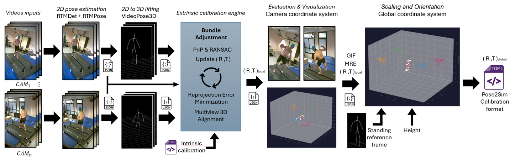

# Dynamic Extrinsic Camera Calibrator

This repository provides a complete pipeline for **Extrinsic Camera Calibration from a Moving Person**. It leverages human pose estimation to calibrate cameras without needing a checkerboard or specialized patterns.

### 🎥 Pipeline Overview

The pipeline automatically processes multiple synchronized video streams to compute the extrinsic parameters (R, t) of all cameras, scaling them to a real-world coordinate system.




[Pose2Sim](https://github.com/perfanalytics/pose2sim) demo files *

### 🛠️ How it Works

1.  **Pose Detection**: We use **RTMPose** to detect 2D joints of a person moving in the scene across all camera views.
2.  **Lifting**: Those 2D detections are "lifted" into 3D space using **VideoPose3D** to get a canonical 3D skeleton.
3.  **Calibration**: By matching the 3D skeleton to the 2D detections in each camera, the system computes the relative position and orientation of every camera.
4.  **Scaling**: Finally, the scene is oriented and scaled using the person's height and a reference frame, resulting in a standard TOML calibration file.

---

## ✨ Key Improvements & Features

This repository is an improved and customized version of [Extrinsic Camera Calibration From a Moving Person](https://github.com/kyotovision-public/extrinsic-camera-calibration-from-a-moving-person) (IROS 2022 and RA-L). 

While the core optimization engine for calculating extrinsic parameters is preserved, several major improvements and modernizations have been integrated into this pipeline:

* **Modern 2D Pose Estimation**: Replaced Detectron with **RTMPose** (via `rtmlib`) for faster and more accurate 2D joint detection.
* **3D Pose Lifting**: We continue to use **VideoPose3D** for 2D-to-3D pose lifting.
* **Streamlined Optimization**: Focuses on **Linear** and **Linear Bundle Adjustment** for the extrinsic parameter calculation (RANSAC is available in the codebase but removed from the main pipeline).
* **True World Coordinates**: Extrinsic parameters are now computed in a **true world coordinate system with real dimensions** by providing a reference frame at the end of the pipeline.
* **Standardized Intrinsics Input**: Intrinsic parameters are now provided via a `Calib.toml` file, identical to the format used in [Pose2Sim](https://github.com/perfanalytics/pose2sim).
* **Partial Video Processing**: Support for selecting and processing only a specific segment/part of a video instead of the whole file.

## 1. Prerequisites

 ⚠️ **Operating System Requirement:** This project is strictly designed to run on **Linux**. If you are a Windows user, you must use **Ubuntu via WSL2** (Windows Subsystem for Linux).
 
 ### 1. Download the Project
 First, open your Linux/WSL terminal and clone this repository to your local machine:
 
 ```bash
 git clone https://github.com/flodelaplace/lab-camera-dynamic-calibrator.git
 cd lab-camera-dynamic-calibrator
 ```
 
 ### 2. Environment Setup
We recommend using Anaconda/Miniconda to manage the environment. The required packages and their specific versions (including PyTorch with CUDA support and RTMPose dependencies) are listed in `conda_linux.yaml`.

```bash
conda env create -f conda_linux.yaml
conda activate human_calib
```

## 2. Models & Third-party Dependencies

After setting up the conda environment, you need to download the VideoPose3D library and its pretrained models. We provide a quick setup script that handles the git submodule initialization and model download:

```bash
bash setup_models.sh
```
*(Note: This script will automatically clone VideoPose3D into `./third_party/VideoPose3D` if it's missing, and download the necessary weights into `./model/`).*

### 💡 WSL2 & GPU Support
If you are running this pipeline in **WSL2** and encounter issues with CUDA (e.g., `libcuda.so` not found), ensure your library path includes the Windows-side drivers:
```bash
export LD_LIBRARY_PATH=/usr/lib/wsl/lib:$LD_LIBRARY_PATH
```
You can add this line to your `~/.bashrc` to make it permanent.

## 3. Fast Demo Setup 🚀

Want to test the pipeline right away? A demo dataset with 4 synchronized videos and a base `Calib_scene.toml` is provided in the `demo/` folder.

You can run the full calibration on this demo dataset in one single command:

```bash
bash ./calibrate.sh \
    "demo/" \
    "demo/Calib_scene.toml" \
    "./output/demo_calibration" \
    "cuda" \
    "balanced" \
    --height 1.80 \
    --ref_frame 5 \
    --frame_skip 10
```

Once finished, the final fully-scaled extrinsic calibration TOML and a 3D visualization GIF will be available in `./output/demo_calibration/results/`.

## 4. Full Guide & Pipeline Execution

To use this pipeline with **your own data**, or to understand the inner workings step-by-step (2D extraction -> 3D lifting -> Calibration -> World Scaling), please check out the **[HOWTO.md](HOWTO.md)**.

## Acknowledgments & Citations

If you use this code, please acknowledge the original authors of the extrinsic calibration engine:
```bibtex
@ARTICLE{9834083,
  author={Lee, Sang-Eun and Shibata, Keisuke and Nonaka, Soma and Nobuhara, Shohei and Nishino, Ko},
  journal={IEEE Robotics and Automation Letters},
  title={Extrinsic Camera Calibration From a Moving Person},
  year={2022},
  volume={7},
  number={4},
  pages={10344--10351},
  doi={10.1109/LRA.2022.3192629}}
```
